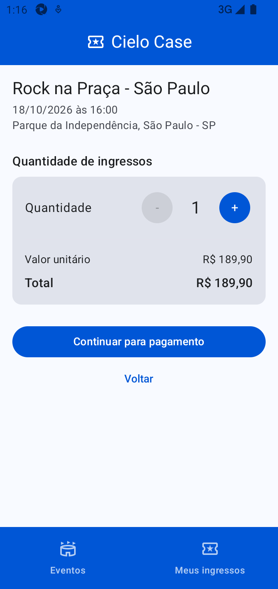
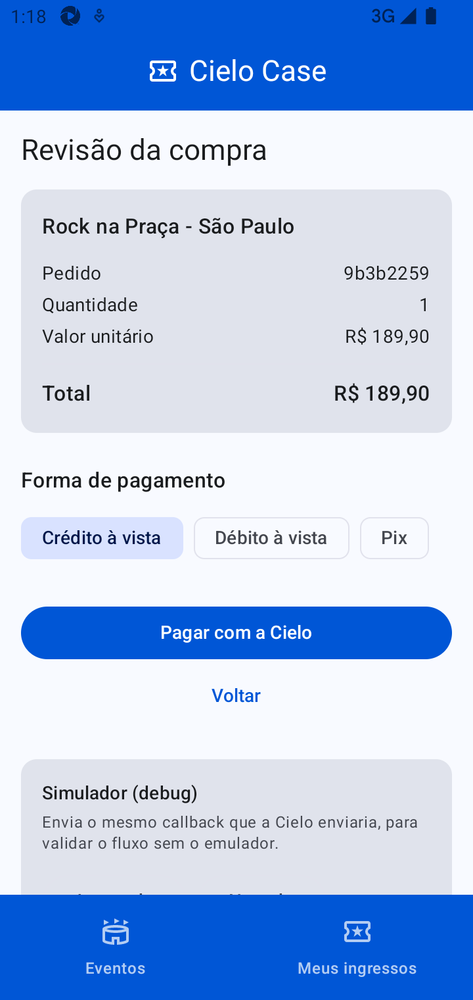
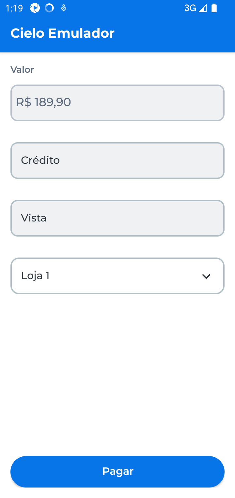
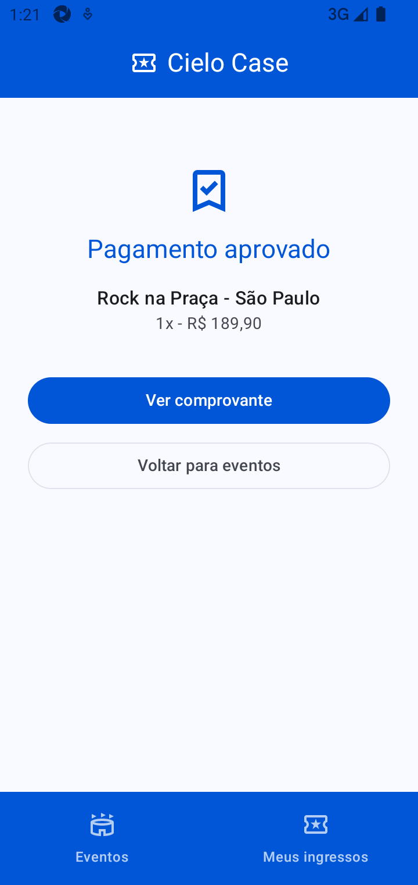

# Cielo Case - venda de ingressos com pagamento na Cielo Smart

App Android (Kotlin + Compose) de compra de ingressos integrado ao ecossistema **Cielo Smart**
via **deep link** (`lio://payment`). Eventos são hardcoded (não há backend); compras, resultados
de pagamento e ingressos são persistidos localmente em Room.

|            Events (home)            |                 My Tickets                  |
|:-----------------------------------:|:-------------------------------------------:|
|  |  |

<details>

<summary>Usage flow -></summary>

|               Events                |                     Ticket Selection                      | Payment Review                                    | Open Cielo Emulator                               | Choose Result type                                       | Payment Result (Success)                                  | Payment Receipt                                     |
|:-----------------------------------:|:---------------------------------------------------------:|---------------------------------------------------|---------------------------------------------------|----------------------------------------------------------|-----------------------------------------------------------|-----------------------------------------------------|
|  |  |  |  |  |  |  |

</details>

|                         |                                                                           |
|-------------------------|---------------------------------------------------------------------------|
| Linguagem / UI          | Kotlin, Jetpack Compose (Material 3)                                      |
| DI / Dados              | Hilt, Room                                                                |
| Integração de pagamento | Cielo Smart via deep link (`lio://payment` + callback `order://response`) |
| QR Code                 | ZXing (`com.google.zxing:core`)                                           |
| Observabilidade         | Sentry (opt-in por DSN, com *scrubbing* de credenciais)                   |
| Qualidade               | detekt, 46 testes JVM + 4 testes instrumentados                           |

Documentação complementar (harness do agente):

- [`docs/SPEC.md`](docs/SPEC.md) - especificação executável: requisito → implementação → teste
- [`docs/ARCHITECTURE.md`](docs/ARCHITECTURE.md) - ADRs detalhados e achados de campo
- [`docs/AI-USAGE.md`](docs/AI-USAGE.md) - como a IA foi usada: prompts, restrições e resultados
- [`AGENTS.md`](AGENTS.md) - comandos de build/verificação do projeto

## Índice

1. [Fluxo do app](#1-fluxo-do-app)
2. [Instruções de execução](#2-instruções-de-execução)
3. [Decisões arquiteturais](#3-decisões-arquiteturais)
4. [Bibliotecas externas e justificativas](#4-bibliotecas-externas-e-justificativas)
5. [Como foi feita a integração com a Cielo Smart](#5-como-foi-feita-a-integração-com-a-cielo-smart)
6. [Prevenção de cobrança duplicada](#6-prevenção-de-cobrança-duplicada)
7. [Tratamento de erros](#7-tratamento-de-erros-de-integração)
8. [Observabilidade (Sentry)](#8-observabilidade-sentry)
9. [Testes](#9-testes)
10. [Trade-offs considerados](#10-trade-offs-considerados)
11. [O que faria com mais tempo](#11-o-que-faria-com-mais-tempo)
12. [Estrutura do projeto](#12-estrutura-do-projeto)

---

## 1. Fluxo do app

```
Eventos → Quantidade → Revisão → [Cielo Smart] → Resultado → Comprovante + QR Code
                                                     ↓
                                              Meus ingressos
```

1. **Visualizar eventos** - lista com data, local, preço, disponibilidade e estado de vendas.
2. **Selecionar quantidade** - limite de 6 ingressos por compra e validação de estoque.
3. **Iniciar e concluir o pagamento** - deep link para a Cielo Smart (crédito à vista, débito à
   vista ou Pix) e retorno pelo callback `order://response`.
4. **Registrar o resultado** - `APPROVED`, `DENIED`, `CANCELLED` ou `FAILED` (falha de
   integração), sempre gravado no banco assim que o callback chega.
5. **Comprovante** - dados da transação (autorização, código Cielo, cartão, terminal) e
   ingressos com QR Code vinculados à compra aprovada.

## 2. Instruções de execução

### 2.1 Pré-requisitos

- JDK 21 (o projeto compila com `sourceCompatibility`/`targetCompatibility` 21)
- Android SDK com API 37; device ou emulador Android (minSdk 29)
- **Emulador Cielo Smart** instalado no mesmo device
  ([como baixar](https://docs.cielo.com.br/cielo-smart/docs/baixando-o-emulador-cielo)).
  Segundo a Cielo, o emulador deve ser instalado em dispositivos/AVDs — nunca em terminais debug.
- Credenciais
  do [Portal de Desenvolvedores Cielo](https://desenvolvedores.cielo.com.br/api-portal/),
  com a API **Cielo Smart - Order Manager** selecionada: `Client-ID` e `Access Token`

### 2.2 Configuração das credenciais

As credenciais **não** ficam no versionamento: são lidas de `local.properties` (ou de variáveis de
ambiente, útil em CI) e injetadas em `BuildConfig` pelo `app/build.gradle.kts`.

```properties
# local.properties
sdk.dir=/caminho/para/Android/sdk
CIELO_CLIENT_ID=seu-client-id
CIELO_ACCESS_TOKEN=seu-access-token
CIELO_MERCHANT_CODE=# opcional, apenas em cenários MULTI-EC
```

Sem credenciais o app **não tenta pagar**: exibe o erro explícito *"Credenciais da Cielo não
configuradas..."*.

### 2.3 Rodando o app

```bash
./gradlew :app:installDebug        # compila e instala no device/emulador conectado
adb shell monkey -p com.example.cielocase -c android.intent.category.LAUNCHER 1
```

Ou abra o projeto no Android Studio e execute a configuração `app`.

### 2.4 Executando um pagamento

**Com o emulador Cielo Smart (caminho real):** *Comprar ingressos* → escolha a quantidade →
*Continuar para pagamento* → *Pagar com a Cielo* → o emulador abre com o valor da compra →
*Pagar* → escolha `Sucesso`, `Cancelado` ou `Erro` → o app volta automaticamente para a tela de
resultado e, quando aprovado, emite os ingressos com QR Code.

**Sem o emulador (builds debug):** a tela de revisão exibe o bloco *Simulador (debug)*, que injeta
exatamente o mesmo callback que a Cielo enviaria (`order://response?response=<base64>`), passando
pelo mesmo parser, pela mesma liquidação e pelas mesmas telas da integração real.

### 2.5 Verificação completa

```bash
./gradlew :app:assembleDebug :app:testDebugUnitTest :app:detekt
./gradlew :app:connectedDebugAndroidTest   # requer device conectado
```

## 3. Decisões arquiteturais

Resumo; o racional completo (10 ADRs) está em [`docs/ARCHITECTURE.md`](docs/ARCHITECTURE.md).

```
        ui (Compose + ViewModels)
                 │  observa Flows / dispara casos de uso
        domain (Kotlin puro: sem Android, Room ou Gson)
         ├── model: Event, Purchase, Ticket, TicketQrPayload
         ├── payment: PaymentGateway, PaymentOutcome, PurchaseSettlement
         └── usecase: StartCheckout, StartPayment, RegisterPaymentResult
                 │  interfaces (EventRepository, PurchaseRepository, PaymentGateway)
        data (Room, catálogo hardcoded, integração Cielo)
```

1. **Integração por deep link, não por SDK** - foi a opção escolhida para o case e é a recomendada
   pela Cielo para integrações locais (sem dependência de SDK, menos conflito de bibliotecas).
2. **Domínio isolado de Android** - as regras críticas (quantidade, estoque, liquidação, QR Code) e
   o próprio formato de fio da integração rodam em testes JVM, sem emulador.
3. **`PaymentGateway` como interface de domínio** - `CieloDeeplinkGateway` é a única classe que
   toca `Intent`/`PackageManager`; os casos de uso usam um fake nos testes.
4. **Fonte da verdade é o banco, não a tela** - o callback é tratado por `CieloCallbackHandler` em
   um escopo de aplicação e gravado imediatamente; as telas apenas observam `Flow<Purchase?>`.
   Um pagamento aprovado não se perde se o usuário sair da tela ou o processo morrer.
5. **Idempotência pelo `reference`** - o `id` da compra (UUID) é criado antes do pagamento e
   enviado como `reference` da ordem; é a chave de idempotência de ponta a ponta (seção 6).
6. **Decisão de liquidação como função pura** - `PurchaseSettlement.decide(...)` define o novo
   estado e se emite ingressos; o repositório Room só aplica a decisão dentro de uma transação.
7. **Reserva de estoque atômica** - `UPDATE events SET availableTickets = availableTickets - :n
   WHERE availableTickets >= :n`; o número de linhas afetadas indica sucesso. Resultados não
   aprovados devolvem o estoque.
8. **Valores sempre em centavos (`Long`)** - igual ao contrato da Cielo (`value: "10000"`);
   formatação apenas na UI.
9. **QR Code assinado com o `authCode` da Cielo** - garante o vínculo do ingresso com a compra
   **concluída** e permite validação offline no portão.
10. **Paleta de marca fixa** - *dynamic color* desligado: num fluxo de checkout com marca, a cor
    não deve variar conforme o wallpaper do device.

## 4. Bibliotecas externas e justificativas

| Biblioteca                                     | Uso                                                                   | Por que essa escolha                                                                                                                                                                                 |
|------------------------------------------------|-----------------------------------------------------------------------|------------------------------------------------------------------------------------------------------------------------------------------------------------------------------------------------------|
| **Jetpack Compose + Material 3**               | toda a UI                                                             | padrão atual do Android; telas declarativas e estado unidirecional, o que deixa a UI fina e a lógica no domínio                                                                                      |
| **Navigation Compose**                         | navegação entre eventos/checkout/revisão/resultado/comprovante        | rotas com argumentos tipados via `SavedStateHandle`, integrando bem com os ViewModels                                                                                                                |
| **Hilt**                                       | injeção de dependências                                               | padrão do Google para Android, gera o grafo em tempo de compilação e permite trocar `PaymentGateway`/repositórios por fakes                                                                          |
| **Room**                                       | compras, ingressos e catálogo                                         | precisa-se de **transação** para liquidar o pagamento e reservar estoque sem duplicidade; Room dá isso (`withTransaction`) + `Flow` reativo e índice único de ingressos                              |
| **Gson**                                       | serialização do payload da Cielo (JSON → Base64) e parsing do retorno | sem plugin de compilador (o módulo usa o Kotlin embutido do AGP 9, sem KGP aplicado, o que tornaria `kotlinx.serialization` mais invasivo); reflexivo, estável e suficiente para um contrato pequeno |
| **ZXing Core** (`com.google.zxing:core`)       | geração do QR Code do ingresso                                        | biblioteca de referência, JVM puro (sem dependência de Android), então o encoding pode ser testado e renderizado como `Bitmap` em uma função pequena                                                 |
| **kotlinx-coroutines-test**                    | testes de casos de uso e ViewModels                                   | `runTest` para código `suspend`/`Flow` sem flakiness                                                                                                                                                 |
| **androidx.room:room-testing** + AndroidX Test | testes instrumentados do repositório                                  | valida as transações reais do SQLite (`inMemoryDatabaseBuilder`)                                                                                                                                     |
| **detekt** (já no scaffold)                    | análise estática                                                      | mantém o código consistente; regras ajustadas com justificativa no `detekt/detekt.yml`                                                                                                               |
| **Sentry** (`sentry-android-core`, opt-in)     | observabilidade de erros                                              | já estava no scaffold; mantido apenas o core (sem replay/NDK/instrumentação), com init manual, *scrubbing* de credenciais e PII desligado — ver [seção 8](#8-observabilidade-sentry)                 |

Deliberadamente **não** adicionadas: cliente HTTP (não há backend), biblioteca de mocks (fakes
escritos à mão bastam e documentam melhor o contrato) e Robolectric (o domínio e o parser são
Kotlin puro, então rodam direto na JVM).

## 5. Como foi feita a integração com a Cielo Smart

### 5.1 Descoberta do contrato

O contrato foi extraído da documentação oficial antes de qualquer código — as páginas são SPA,
então foi usado o markdown puro (`<url>.md`) de
[Pagamento](https://docs.cielo.com.br/cielo-smart/docs/pagamento),
[Recuperando dados do pagamento](https://docs.cielo.com.br/cielo-smart/docs/recuperando-dados),
[Códigos de erro](https://docs.cielo.com.br/cielo-smart/docs/codigos-de-erro) e
[Configurando o Android Manifest](https://docs.cielo.com.br/cielo-smart/docs/configurando-o-android-manifest).
O formato exato da URI foi confirmado cruzando a documentação de cancelamento/impressão com o
[sample oficial em React Native](https://github.com/matheus-caldeira/cielo_sample).

### 5.2 Requisição

`CieloPaymentRequestFactory` monta o JSON documentado, converte para Base64 e produz:

```
lio://payment?request=<base64(json)>&urlCallback=order://response
```

```json
{
  "accessToken": "...",
  "clientID": "...",
  "reference": "<id da compra = idempotency key>",
  "merchantCode": "<opcional, MULTI-EC>",
  "installments": 0,
  "items": [
    {
      "name": "Rock na Praça",
      "quantity": 2,
      "sku": "evt-rock-sp",
      "unitOfMeasure": "unidade",
      "unitPrice": 18990
    }
  ],
  "paymentCode": "CREDITO_AVISTA",
  "value": "37980"
}
```

`CieloDeeplinkGateway` dispara `Intent(ACTION_VIEW)` com essa URI. Antes disso valida credenciais e
`resolveActivity`, devolvendo falhas **explícitas** (`MISSING_CREDENTIALS`,
`CIELO_APP_UNAVAILABLE`) sem nada ter sido cobrado. `paymentCode` suportados na UI:
`CREDITO_AVISTA`, `DEBITO_AVISTA` e `PIX`.

### 5.3 Resposta

A `MainActivity` é o contrato de resposta declarado no manifesto
(`launchMode="singleTask"` → o retorno chega em `onNewIntent`):

```xml

<intent-filter>
    <action android:name="android.intent.action.VIEW" />
    <category android:name="android.intent.category.DEFAULT" />
    <category android:name="android.intent.category.BROWSABLE" />
    <data android:host="response" android:scheme="order" />
</intent-filter>
```

`CieloCallbackParser` decodifica `response` (Base64 → JSON) e traduz para o domínio:

| Payload                                                  | Resultado                                                                |
|----------------------------------------------------------|--------------------------------------------------------------------------|
| ordem com `paymentFields.statusCode` = `1` (ou `0`, Pix) | `Approved` + `authCode`, `cieloCode`, bandeira, máscara, terminal, valor |
| ordem com `statusCode` = `2` (estorno)                   | `Rejected(PAYMENT_DENIED)`                                               |
| `{"code":1,"reason":"CANCELADO PELO USUÁRIO"}`           | `Rejected(USER_CANCELLED)`                                               |
| `{"code":3,...}` / `{"code":4,...}` / `{"code":2,...}`   | `Rejected(PAYMENT_DENIED / AUTHENTICATION / GENERIC)`                    |
| Base64 ou JSON inválido, ou sem `response`               | `Rejected(INVALID_RESPONSE)`                                             |

O resultado é gravado por `RegisterPaymentResultUseCase` → `PurchaseRepository.settle()` em
transação, e a UI reage ao estado da compra no banco.

### 5.4 Dois achados de campo (validados no emulador)

1. **O pacote do app de pagamento não é o documentado.** A doc manda declarar
   `com.ads.lio.uriappclient` em `<queries>`, mas o emulador atual publica os deep links em
   `br.com.cielosmart.orderservice`. Sem isso, `resolveActivity` retorna `null` no Android 11+ e o
   pagamento nunca abre. O manifesto declara **os dois pacotes e também um `<intent>` com
   `android:scheme="lio"`**, para não depender do nome do pacote.
2. **O Base64 do callback vem com quebras de linha** (`Base64.DEFAULT` insere `\n` a cada 76
   caracteres), o que faz parsers estritos como `java.net.URI` rejeitarem a URI de retorno — o
   pagamento era aprovado e a tela ficava "aguardando". O parser passou a ler o query string
   manualmente e a ignorar espaços em branco antes de decodificar (teste dedicado:
   `parses payloads whose base64 contains line breaks`).

## 6. Prevenção de cobrança duplicada

Quatro camadas independentes:

1. **Idempotency key** - a compra é criada com um `id` (UUID) antes do pagamento e enviada à Cielo
   como `reference`. Toda a conciliação usa essa chave.
2. **Reuso do pedido pendente** - reenviar a ação de checkout para o mesmo evento/quantidade
   reaproveita a compra pendente (`createOrReusePending`), sem criar nova reserva.
3. **Guard de pagamento em andamento** - `StartPaymentUseCase` recusa pagar uma compra já
   finalizada ou com pagamento em voo (janela de 3 min; depois permite retry reusando o **mesmo**
   `reference`). O botão também é bloqueado na UI.
4. **Liquidação única** - `settle()` roda em transação Room e, se a compra já estiver em estado
   terminal, o callback é no-op (`SettleResult.Duplicate`); ingressos nunca são emitidos duas vezes
   (índice único `purchaseId + sequence`).

Como os payloads de erro da Cielo não trazem `reference`, o `reference` em voo é persistido
localmente (`InFlightPaymentStore`) e usado como fallback — e sobrevive à morte do processo.

Retentar uma compra **negada/cancelada** cria um **novo** pedido (novo `reference`): uma compra
liquidada nunca é paga novamente.

## 7. Tratamento de erros de integração

| Situação                           | Estado / mensagem                                                                                    |
|------------------------------------|------------------------------------------------------------------------------------------------------|
| Credenciais ausentes               | nada é cobrado; erro explícito com o nome das chaves                                                 |
| Nenhum app resolve `lio://payment` | *"Não encontramos o aplicativo de pagamento da Cielo..."*                                            |
| `code: 1` (cancelado pelo usuário) | compra `CANCELLED`, estoque devolvido                                                                |
| `code: 3` (erro no pagamento)      | compra `DENIED`, estoque devolvido                                                                   |
| `code: 4` (autenticação)           | compra `FAILED` + orientação para revisar clientID/accessToken                                       |
| Payload ilegível / sem `response`  | compra `FAILED` (`INVALID_RESPONSE`)                                                                 |
| Callback sem `reference`           | resolvido pelo `reference` em voo persistido localmente                                              |
| App morto durante o pagamento      | callback abre a activity (`singleTask`), grava o resultado e a tela é reconstruída a partir do banco |

## 8. Observabilidade (Sentry)

### 8.1 Como está configurado

| Camada        | Configuração                                                                                                                                                 |
|---------------|--------------------------------------------------------------------------------------------------------------------------------------------------------------|
| DSN           | `SENTRY_DSN` em `local.properties`/ambiente → `BuildConfig.SENTRY_DSN` (igual às credenciais da Cielo)                                                       |
| Inicialização | manual em `SentryConfig`, chamada por `App.onCreate()` **apenas se o DSN não estiver vazio**; auto-init desligado no manifesto (`io.sentry.auto-init=false`) |
| Dependências  | somente `io.sentry:sentry-android-core`; `autoInstallation` e `tracingInstrumentation` desligados no bloco `sentry { }`                                      |
| Build         | sem upload de mapping/source context e sem telemetria de build (nenhum auth token no build)                                                                  |
| Privacidade   | `isSendDefaultPii = false`, sem screenshot, sem view hierarchy, `tracesSampleRate = 0.0`, NDK desligado                                                      |
| Segurança     | `beforeSend` remove credenciais da Cielo de mensagens, exceções e breadcrumbs                                                                                |
| Permissões    | `INTERNET` e `ACCESS_NETWORK_STATE` existem **apenas** para o envio de eventos (o fluxo de compra é offline)                                                 |

Habilitar é opt-in:

```properties
# local.properties
SENTRY_DSN=https://<public-key>@<org>.ingest.sentry.io/<project>
```

Sem DSN o app não inicializa o SDK e não faz nenhuma requisição de rede.

### 8.2 Scrubbing de credenciais (por que existe)

O deep link de pagamento carrega `request=<base64>`, e esse Base64 contém `accessToken` e
`clientID`. Mensagens de exceção do Android ecoam a Intent inteira — por exemplo
`ActivityNotFoundException: No Activity found to handle Intent { act=VIEW dat=lio://payment?request=eyJhY2Nlc3NUb2tlbiI6... }`.
Sem tratamento, essas credenciais iriam para o Logcat, para o campo `reason` da compra (gravado no
banco e exibido na UI) e para o Sentry.

`SensitiveData.redact()` (testado em `SensitiveDataTest`) é aplicado nos três pontos:
`Throwable.log()`, o `reason` devolvido pelo `CieloDeeplinkGateway` e o `beforeSend` do Sentry.

### 8.3 Como validar

```bash
# com um DSN configurado em local.properties
./gradlew :app:installDebug
adb logcat -d | grep -i sentry
# esperado: "io.sentry.auto-init read: false", "Initializing SDK with DSN: ...",
#           "NdkIntegration enabled: false" e nenhum "Failed to register network callback"
```

Com um DSN de exemplo (chave pública inválida) o SDK inicializa e o envio falha com HTTP 400 —
o que confirma que o transporte está funcionando de ponta a ponta.

## 9. Testes

```bash
./gradlew :app:testDebugUnitTest          # 46 testes JVM (contrato do deep link + domínio)
./gradlew :app:connectedDebugAndroidTest  # 4 testes Room (transações reais) - requer device
./gradlew :app:detekt                     # análise estática
```

Cenários críticos cobertos: formato do request (`lio://payment`), parsing de todos os retornos
documentados (aprovado, cancelado, negado, erro de autenticação, payload corrompido, Base64 com
quebras de linha), regras de quantidade/estoque, **prevenção de cobrança duplicada**, idempotência
de callbacks duplicados, emissão de ingressos apenas para compras aprovadas e assinatura do QR
Code. O fluxo real também foi validado no emulador Cielo Smart (aprovado, negado e a recusa do
segundo pagamento no mesmo pedido).

## 10. Trade-offs considerados

| Decisão                                       | Alternativa                                 | Por que a escolha, e o que se perde                                                                                                                                                                                                   |
|-----------------------------------------------|---------------------------------------------|---------------------------------------------------------------------------------------------------------------------------------------------------------------------------------------------------------------------------------------|
| Deep link `lio://`                            | SDK Order Manager                           | deep link foi o pedido do case e evita dependência/conflito de SDK; **perde-se** a API tipada e o retorno síncrono — exigiu contrato de callback, `singleTask` e estado persistido                                                    |
| Guard de idempotência local (janela de 3 min) | *foreground service* recomendado pela Cielo | mantém o app simples e a resiliência vem da persistência do estado; **perde-se** a garantia de sobreviver ao *process kill* exatamente no meio do pagamento (o pedido fica pendente e retomável, em vez de resolvido automaticamente) |
| Retry cria novo pedido                        | reusar o `reference` da compra recusada     | elimina qualquer risco de cobrança dupla sobre um pedido liquidado; **perde-se** a leitura "uma compra, várias tentativas" no histórico                                                                                               |
| Catálogo hardcoded gravado no Room            | lista em memória                            | permite reserva de estoque transacional e histórico coerente, próximo do que seria com backend; **custa** uma tabela e um seed a mais                                                                                                 |
| Gson                                          | kotlinx.serialization                       | evita adicionar plugin de compilador ao módulo (AGP 9 com Kotlin embutido); **perde-se** serialização sem reflexão e checagem em tempo de compilação                                                                                  |
| Parsing manual da URI de callback             | `android.net.Uri`                           | tornou o parser Kotlin puro (testável na JVM) e tolerante ao Base64 com `\n` — que era exatamente o bug real; **custa** ~10 linhas de parsing de query string                                                                         |
| Fakes escritos à mão                          | MockK/Mockito                               | testes legíveis e que documentam o contrato dos repositórios; **custa** manter o fake em sincronia com a interface                                                                                                                    |
| QR assinado com segredo no app                | assinatura no backend                       | viabiliza validação offline no case sem backend; **inseguro para produção** — o segredo está no APK (documentado como demonstrativo)                                                                                                  |
| *Dynamic color* desligado                     | paleta do wallpaper                         | identidade visual consistente (azul Cielo); **perde-se** a personalização do Material You                                                                                                                                             |
| Uma única `Activity`                          | activity dedicada só para o callback        | menos superfície e navegação centralizada; **exige** `launchMode="singleTask"` e cuidado com `onNewIntent`                                                                                                                            |

## 11. O que faria com mais tempo

**Robustez da integração**

- **Reconciliação de pedidos pendentes** via `lio://order` / `lio://orders` (consulta de pedido e
  listagem): hoje, se o callback nunca chega, a compra fica `PENDING` e depende de retry manual.
  Com a consulta seria possível resolver o estado automaticamente ao reabrir o app.
- **Foreground service** ao disparar o deep link, como a Cielo recomenda, para o app de integração
  não ser morto durante o pagamento.
- **Estorno** (`lio://payment-reversal`) e **impressão do comprovante** no terminal
  (`lio://print`) — contratos já mapeados em `CieloDeeplink`, faltando UI e casos de uso.
- Suporte a **parcelamento** (`installments` > 0) e a cenários **MULTI-EC**/split de pagamento.

**Qualidade**

- Testes de UI com `compose-ui-test` (fluxo completo com gateway fake) e *screenshot tests* das
  telas de resultado/comprovante.
- CI (GitHub Actions) rodando `detekt`, testes JVM e, em emulador, os instrumentados; cobertura
  publicada como artefato.
- `exportSchema = true` no Room com migrações versionadas e testadas (hoje o schema é v1, sem
  histórico a preservar).

**Produto e produção**

- Backend de bilheteria: catálogo real, reserva com TTL, assinatura do QR Code no servidor e
  endpoint de validação no portão (removendo o segredo do APK).
- Validador de ingresso (leitura de QR + verificação de assinatura e de uso único).
- Instrumentar o funil de pagamento no Sentry: breadcrumbs por transição de estado da compra,
  tags de `paymentCode`/`PaymentFailureKind` e alerta em `FAILED`/pendências sem callback. A base
  (init, scrubbing, privacidade) já está pronta na [seção 8](#8-observabilidade-sentry); falta a
  instrumentação de negócio e um DSN real.
- Acessibilidade (TalkBack, tamanhos de fonte), suporte a tablet/landscape e internacionalização
  (hoje o app é pt-BR).

## 12. Estrutura do projeto

```
app/src/main/java/com/example/cielocase/
├── core/                 # Application, MainActivity (contrato order://response), navegação
├── domain/               # modelos, regras e casos de uso (sem Android)
│   ├── model/            # Event, Purchase, Ticket, TicketQrPayload
│   ├── payment/          # PaymentGateway, PaymentOutcome, PurchaseSettlement
│   └── usecase/          # StartCheckout, StartPayment, RegisterPaymentResult
├── data/
│   ├── catalog/          # EventCatalog (eventos hardcoded)
│   ├── local/            # Room: entidades, DAOs, AppDatabase
│   ├── payment/cielo/    # contrato do deep link: request factory, parser, gateway, callback
│   ├── payment/simulator/# callbacks simulados (debug/testes)
│   └── repository/       # implementações Room dos repositórios
├── di/                   # módulos Hilt
└── ui/                   # telas Compose + ViewModels
```

### Limitações conhecidas

- Sem backend: catálogo hardcoded, reserva/estoque e validação do QR Code são locais. O segredo de
  assinatura do ingresso (`TICKET_SIGNING_SECRET`) é apenas demonstrativo.
- Compras `PENDING` sem callback dependem de retry manual (ver seção 11).
- Cancelamento/estorno e impressão no terminal não estão implementados na UI.
